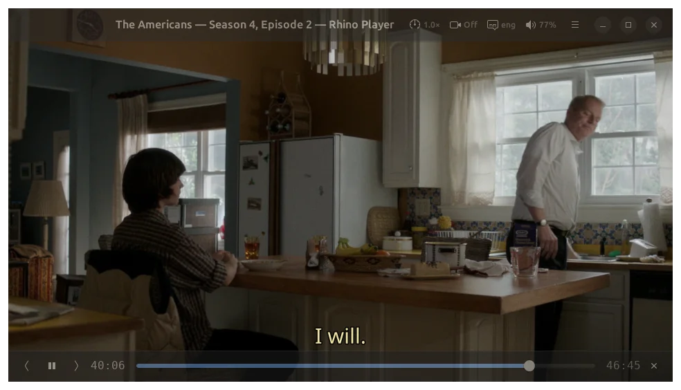

# Rhino Player

<p align="center">
  
</p>

Rhino Player is a desktop video player for Linux (GNOME, Ubuntu, and similar systems) and macOS. It combines mpv playback with a GTK 4 / libadwaita interface, focused on smooth watching, quick resume, and simple local-file workflows. Linux is the primary target; macOS support is experimental and built on top of Homebrew.

## Screenshots

<p align="center">
  
</p>

*Main window while playing a video.*

## Features

- **mpv-powered format support:** play the local video formats supported by your installed mpv/libmpv, including common containers such as MKV, MP4, WebM, AVI, MOV, MPEG-TS, and more.
- **Blu-ray and DVD (folder rips):** open a ripped **Blu-ray** tree (`BDMV/`, including AVCHD layouts) or a **DVD** tree (`VIDEO_TS/`, or any chapter `.vob` inside it). Blu-ray plays through mpv’s disc mode; Rhino applies Bob deinterlace on interlaced 1080i/60i content so fields play at full temporal rate. DVD titles split across `VTS_XX_*.VOB` chapter files play as **one title**—one seek bar, one resume entry in Continue, and scrubbing across the full movie; **Previous** / **Next** walk chapter files in order (and still advance to the next folder when the title ends).
- **Continue where you left off:** start on a recent-video grid with thumbnails, progress, and one-click resume.
- **TV-series friendly playback:** continue through episodes in a folder, then into the next sibling folder at the same level (e.g. next season beside the current one), without jumping to unrelated folders that only share a higher folder.
- **Optional Smooth Video (~60 FPS):** smoother motion with VapourSynth + MVTools when your setup supports it. Rhino **adapts how hard this runs while you watch** so it stays closer to what your PC can handle, instead of one fixed load for everyone.
- **Subtitles:** pick subtitle tracks, remember subtitle style preferences, and auto-pick matching subtitle tracks when possible.
- **Audio track switching:** choose between available audio tracks while watching a video.
- **Seek preview:** hover over the progress bar to preview frames before jumping.
- **Clean playback view:** auto-hiding header, transport controls, and pointer keep the video area focused.
- **Fast playback controls:** play/pause, seek, fullscreen, elapsed/remaining time, keyboard shortcuts, and quick 1.0× / 1.5× / 2.0× / 8.0× speed choices.
- **Continue-list cleanup:** remove items from the continue grid or move local files to Trash, with session undo.
- **Desktop integration:** Freedesktop desktop entry, icon theme assets, and AppStream metadata for GNOME-style launchers and app grids.

See the full feature index in [docs/README.md](docs/README.md).

## Install from GitHub Releases

Prebuilt packages are published on **[github.com/adrianov/rhino-player/releases](https://github.com/adrianov/rhino-player/releases)**. Download the **`.deb`** for your architecture on Debian/Ubuntu (and similar) and install it with your package manager, for example `sudo apt install ./rhino-player_*.deb`. On macOS, use the release **`.zip`** that contains **Rhino Player.app** when available; unzip it, then open the app. macOS still needs GTK 4, libadwaita, and mpv from Homebrew at runtime—see [Build from source → macOS](#macos-experimental) below.

## Build From Source

All platforms need Rust 1.74+ and `pkg-config`. Pass a file path to play it directly:

```bash
./target/release/rhino-player /path/to/video.mkv
./target/release/rhino-player /path/to/VIDEO_TS/VTS_01_1.VOB
```

### Linux

Install development headers for GTK 4, libadwaita, and libmpv (Debian / Ubuntu names shown):

- `libgtk-4-dev`
- `libadwaita-1-dev`
- `libmpv-dev`
- `build-essential`

```bash
cargo build --release
./target/release/rhino-player
```

### macOS (experimental)

GTK 4, libadwaita, and mpv are provided by [Homebrew](https://brew.sh/). From a shell:

```bash
brew install gtk4 libadwaita mpv pkgconf
export PKG_CONFIG_PATH="$(brew --prefix)/lib/pkgconfig:$(brew --prefix)/share/pkgconfig"
export PATH="$(brew --prefix)/bin:$PATH"
cargo build --release
./target/release/rhino-player
```

**stolendata-mpv cask** (`brew install --cask stolendata-mpv`) does not install `libmpv.dylib`; use the formula `brew install mpv` for Rhino.

Or use the project helper (same exports):

```bash
source ./scripts/macos-dev-env.sh
cargo build --release
```

To assemble **Rhino Player.app** with Retina **`AppIcon.icns`**, `Info.plist` (viewer for common video/audio types so Finder can **Open With** / change default handler), bundled `rhino-player` executable, **`Resources/data/icons`** hicolor assets, and `share/rhino-player/vs` scripts:

```bash
./scripts/macos-build-app-bundle.sh
```

Output: `dist/macos/Rhino Player.app` (respects **`DEST_ROOT`** to change the folder). Libraries still load from Homebrew at runtime (`brew install gtk4 libadwaita mpv`).

**Smooth Video (VapourSynth + MVTools)** is supported on macOS via Homebrew — see the macOS section below. Core playback and the rest of the UI work on macOS too.

## Install (Linux)

For a normal local install from source, build the release binary and install it with the bundled Freedesktop assets:

```bash
cargo build --release
sudo ./data/install-system-wide.sh
```

The installer copies:

- `rhino-player` to `/usr/local/bin`
- bundled VapourSynth scripts to `/usr/local/share/rhino-player/vs`
- desktop launcher, icon theme assets, AppStream metadata, and **`rhino-player(1)`** man page to `/usr/local/share`

You can choose another prefix with `PREFIX`:

```bash
sudo PREFIX=/usr ./data/install-system-wide.sh
```

To build a **`.deb`** for Debian, Ubuntu, or similar (requires `dpkg-deb`, from the `dpkg` package):

```bash
./scripts/build-deb.sh
```

This runs `cargo build --release`, then builds a normal distro layout (binary under `/usr/bin`, Freedesktop assets, **`rhino-player(1)`**, and bundled `share/rhino-player/vs`) and writes **`releases/rhino-player_<version>-1_<arch>.deb`**. Install with `cd releases && sudo apt install ./rhino-player_*.deb`.

Use `OUTPUT=/tmp` for a different output directory or `DEB_REV=2` to bump the package revision. To stage assets for [GitHub Releases](https://docs.github.com/en/repositories/releasing-projects-on-github/about-releases) (including macOS), see [`releases/README.md`](releases/README.md) and `./scripts/stage-github-release.sh`.

For a user-local launcher during development, install only the desktop file and icons under `~/.local/share` and point it at a chosen binary:

```bash
./data/install-to-user-dirs.sh "$PWD/target/release/rhino-player"
```

After installing, launch Rhino Player from your app grid, from a file manager, or with:

```bash
rhino-player /path/to/video.mkv
rhino-player /path/to/Blu-ray/          # folder with BDMV/
rhino-player /path/to/DVD/              # folder containing VIDEO_TS/
```

Manual page: **`man rhino-player`** (after install) or **`man ./doc/rhino-player.1`** from the repository tree.

More detail: [Blu-ray Bob deinterlace](docs/features/29-bluray-deinterlace.md), [DVD unified timeline](docs/features/30-dvd-unified-timeline.md).

## Smooth 60 FPS Setup

Rhino’s **Preferences → Smooth Video (60 FPS)** uses mpv’s VapourSynth video filter plus MVTools. This is optional; normal playback works without it. **With the built-in script, Rhino adjusts automatically** so the option stays practical on slower machines as well as fast ones.

### macOS

Homebrew packages everything Smooth 60 needs:

```bash
brew install mpv mvtools
```

`brew install mvtools` pulls VapourSynth in as a dependency and drops `libmvtools.dylib` under `$(brew --prefix)/lib`. Homebrew’s `mpv` formula (0.41+) already ships with the `vapoursynth` video filter, so the same `libmpv` Rhino links against can run the bundled script. Rhino searches both `/opt/homebrew/lib` (Apple Silicon) and `/usr/local/lib` (Intel) automatically; override with `export RHINO_MVTOOLS_LIB=/full/path/to/libmvtools.dylib` if you installed it elsewhere.

Verify before turning the preference on:

```bash
mpv --vf=help 2>&1 | grep -E '^[[:space:]]*vapoursynth[[:space:]]'
python3 -c "import vapoursynth as vs; vs.core.std.LoadPlugin('$(brew --prefix)/lib/libmvtools.dylib'); print(vs.core.mv)"
```

Both lines must print non-empty output. Then enable **Preferences → Smooth Video (60 FPS)** in Rhino.

### Linux

#### Install Dependencies

On Debian / Ubuntu-like systems:

```bash
sudo apt-get install vapoursynth vapoursynth-python3 pipx p7zip-full
pipx install vsrepo
pipx ensurepath
```

Open a new terminal after `pipx ensurepath`, then install MVTools:

```bash
vsrepo update
vsrepo install mvtools
```

Rhino searches the `pipx` / `vsrepo` plugin location automatically. Avoid `python3 -m pip install --user ...` on Debian / Ubuntu systems that report `externally-managed-environment`; use `vsrepo` instead.

#### Verify Support

```bash
mpv -vf help 2>&1 | grep -E '^[[:space:]]*vapoursynth[[:space:]]'
python3 - <<'PY'
from pathlib import Path
import vapoursynth as vs

try:
    print(vs.core.mv)
except AttributeError:
    hits = sorted(Path.home().glob(
        ".local/share/pipx/venvs/vsrepo/lib/python*/site-packages/"
        "vapoursynth/plugins/vsrepo/libmvtools.so"
    ))
    if not hits:
        raise
    vs.core.std.LoadPlugin(str(hits[0]))
    print(vs.core.mv)
PY
```

The first command must print a `vapoursynth` filter. The Python check verifies that VapourSynth imports and MVTools can be loaded, including the common `pipx install vsrepo` layout; it must print an MVTools object instead of failing.

#### If mpv Is Missing VapourSynth

If the first verification command prints nothing, your `mpv` / `libmpv` was built without VapourSynth. Build and install mpv/libmpv with VapourSynth enabled:

```bash
sudo apt-get build-dep mpv
git clone --depth 1 --branch v0.38.0 https://github.com/mpv-player/mpv.git mpv-vapoursynth
cd mpv-vapoursynth
meson setup build -Dlibmpv=true -Dvapoursynth=enabled --prefix=/usr/local
meson compile -C build
sudo meson install -C build
sudo ldconfig
mpv -vf help 2>&1 | grep -E '^[[:space:]]*vapoursynth[[:space:]]'
```

Ubuntu source repositories must be enabled for `apt-get build-dep`. If Meson reports that `build.dat` was generated by an old version, run `meson setup build --wipe -Dlibmpv=true -Dvapoursynth=enabled --prefix=/usr/local`, then compile and install again. If Meson is installed under `~/.local` and `sudo meson install -C build` cannot import it, use `sudo env PYTHONPATH="$(python3 -m site --user-site)" "$(command -v meson)" install -C build`. If you install a custom libmpv under `/usr/local`, verify Rhino loads it before the distro libmpv:

```bash
ldd /path/to/rhino-player | grep libmpv
```

### Use It

Once the checks pass, start Rhino, open a video, and enable **Preferences → Smooth Video (60 FPS)**. The built-in `data/vs/rhino_60_mvtools.vpy` script is used by default on every platform; choose a custom `.vpy` only if you want to replace it.

Smooth 60 runs only around **1.0×** playback speed. At faster fixed steps Rhino skips the filter. Expect higher CPU use while it is active, and a brief warm-up while the filter graph starts.

Those adjustments apply **only when you use the bundled `.vpy`**; pointing Preferences at your own script turns them off.

More detail: [docs/features/26-sixty-fps-motion.md](docs/features/26-sixty-fps-motion.md) and [data/vs/README.md](data/vs/README.md).

## Developer Checks

For quick development runs, `cargo run` is still useful:

```bash
cargo run
cargo run -- /path/to/video.mkv
```

Before submitting changes, run:

```bash
cargo test
cargo qcheck   # cargo clippy --all-targets --all-features
```

The project keeps detailed feature specs and implementation notes under [docs/](docs/). Start with [docs/README.md](docs/README.md).

## Copyright

Copyright © 2026 Peter Adrianov

## License

GPL-3.0-or-later (see `LICENSE`, `COPYRIGHT`, and `Cargo.toml`).
