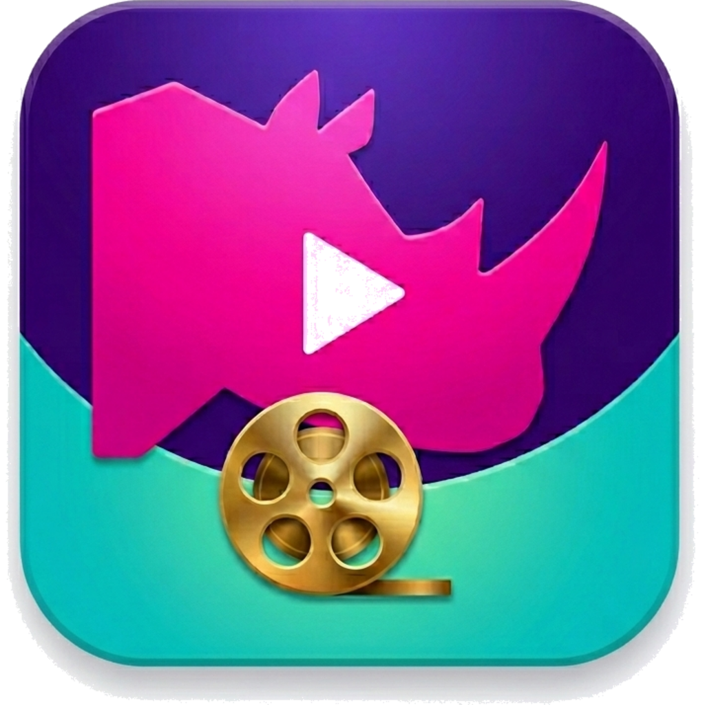

# Rhino Player

<p align="center">
  
</p>

Rhino Player is a Linux desktop video player for GNOME, Ubuntu, and similar systems. It combines mpv playback with a GTK 4 / libadwaita interface, focused on smooth watching, quick resume, and simple local-file workflows.

## Features

- **mpv-powered format support:** play the local video formats supported by your installed mpv/libmpv, including common containers such as MKV, MP4, WebM, AVI, MOV, MPEG-TS, and more.
- **Continue where you left off:** start on a recent-video grid with thumbnails, progress, and one-click resume.
- **TV-series friendly playback:** continue through episodes in a folder, then move into the next sibling folder, making season-by-season watching easier.
- **Optional Smooth Video (~60 FPS at 1.0×):** synthesize smoother motion with VapourSynth + MVTools when your system supports it.
- **Subtitles:** pick subtitle tracks, remember subtitle style preferences, and auto-pick matching subtitle tracks when possible.
- **Audio track switching:** choose between available audio tracks while watching a video.
- **Seek preview:** hover over the progress bar to preview frames before jumping.
- **Clean playback view:** auto-hiding header, transport controls, and pointer keep the video area focused.
- **Fast playback controls:** play/pause, seek, fullscreen, elapsed/remaining time, keyboard shortcuts, and quick 1.0× / 1.5× / 2.0× speed choices.
- **Continue-list cleanup:** remove items from the continue grid or move local files to Trash, with session undo.
- **Desktop integration:** Freedesktop desktop entry, icon theme assets, and AppStream metadata for GNOME-style launchers and app grids.

See the full feature index in [docs/README.md](docs/README.md).

## Build From Source

Requirements:

- Rust 1.74+
- GTK 4 development files (`libgtk-4-dev`)
- libadwaita development files (`libadwaita-1-dev`)
- libmpv development files (`libmpv-dev`)
- `pkg-config`
- `build-essential`

```bash
cargo build --release
./target/release/rhino-player
```

You can pass a file path:

```bash
./target/release/rhino-player /path/to/video.mkv
```

## Install

For a normal local install from source, build the release binary and install it with the bundled Freedesktop assets:

```bash
cargo build --release
sudo ./data/install-system-wide.sh
```

The installer copies:

- `rhino-player` to `/usr/local/bin`
- bundled VapourSynth scripts to `/usr/local/share/rhino-player/vs`
- desktop launcher, icon theme assets, and AppStream metadata to `/usr/local/share`

You can choose another prefix with `PREFIX`:

```bash
sudo PREFIX=/usr ./data/install-system-wide.sh
```

For a user-local launcher during development, install only the desktop file and icons under `~/.local/share` and point it at a chosen binary:

```bash
./data/install-to-user-dirs.sh "$PWD/target/release/rhino-player"
```

After installing, launch Rhino Player from your app grid, from a file manager, or with:

```bash
rhino-player /path/to/video.mkv
```

## Smooth 60 FPS Setup

Rhino’s **Preferences → Smooth Video (~60 FPS at 1.0×)** uses mpv’s VapourSynth video filter plus MVTools. This is optional; normal playback works without it.

### Install Dependencies

On Debian / Ubuntu-like systems:

```bash
sudo apt-get install vapoursynth vapoursynth-python3 pipx p7zip-full
pipx install vsrepo
pipx ensurepath
```

Open a new terminal after `pipx ensurepath`, then install MVTools:

```bash
vsrepo update
vsrepo install mvtools
```

Rhino searches the `pipx` / `vsrepo` plugin location automatically. Avoid `python3 -m pip install --user ...` on Debian / Ubuntu systems that report `externally-managed-environment`; use `vsrepo` instead.

### Verify Support

```bash
mpv -vf help 2>&1 | grep -E '^[[:space:]]*vapoursynth[[:space:]]'
python3 - <<'PY'
from pathlib import Path
import vapoursynth as vs

try:
    print(vs.core.mv)
except AttributeError:
    hits = sorted(Path.home().glob(
        ".local/share/pipx/venvs/vsrepo/lib/python*/site-packages/"
        "vapoursynth/plugins/vsrepo/libmvtools.so"
    ))
    if not hits:
        raise
    vs.core.std.LoadPlugin(str(hits[0]))
    print(vs.core.mv)
PY
```

The first command must print a `vapoursynth` filter. The Python check verifies that VapourSynth imports and MVTools can be loaded, including the common `pipx install vsrepo` layout; it must print an MVTools object instead of failing.

### If mpv Is Missing VapourSynth

If the first verification command prints nothing, your `mpv` / `libmpv` was built without VapourSynth. Install a build that enables it, or build mpv/libmpv yourself with this Meson option:

```bash
-Dvapoursynth=enabled
```

This project includes a helper for Debian / Ubuntu-like systems:

```bash
./scripts/build-mpv-vapoursynth-system.sh
```

If you install a custom libmpv under `/usr/local`, make sure Rhino loads it before the distro libmpv:

```bash
export LD_LIBRARY_PATH=/usr/local/lib/x86_64-linux-gnu:/usr/local/lib:$LD_LIBRARY_PATH
```

### Use It

Once the checks pass, start Rhino, open a video, and enable **Preferences → Smooth Video (~60 FPS at 1.0×)**. The built-in `data/vs/rhino_60_mvtools.vpy` script is used by default; choose a custom `.vpy` only if you want to replace it.

Smooth 60 runs only around **1.0×** playback speed. At 1.5× / 2.0× Rhino skips the filter. Expect higher CPU use while it is active, and a brief warm-up while the filter graph starts.

More detail: [docs/features/26-sixty-fps-motion.md](docs/features/26-sixty-fps-motion.md) and [data/vs/README.md](data/vs/README.md).

## Developer Checks

For quick development runs, `cargo run` is still useful:

```bash
cargo run
cargo run -- /path/to/video.mkv
```

Before submitting changes, run:

```bash
cargo test
cargo clippy --all-targets --all-features
cargo module-lines
cargo qcheck
```

The project keeps detailed feature specs and implementation notes under [docs/](docs/). Start with [docs/README.md](docs/README.md).

[vapoursynth-mvtools]: https://github.com/dubhater/vapoursynth-mvtools

## Copyright

Copyright (C) 2026 Peter Adrianov

## License

GPL-3.0-or-later (see `LICENSE`, `COPYRIGHT`, and `Cargo.toml`).
