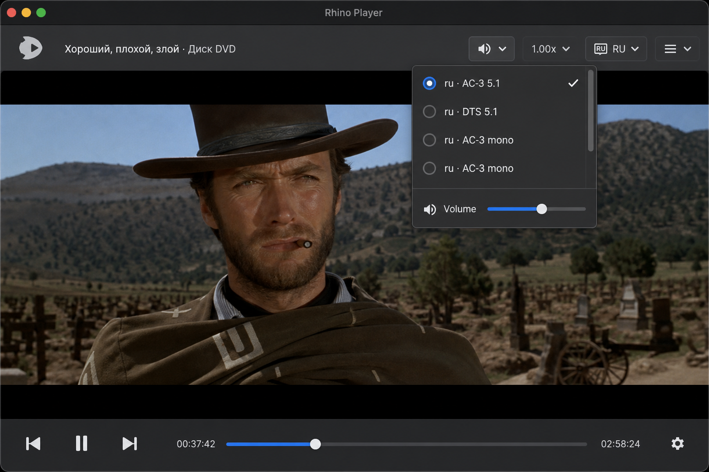

# Tracks: audio, video, subtitles

---
status: wip
priority: p1
layers: [ui, mpv, db]
related: [22, 24]
mpv_props: [track-list, aid, sid, vid]
settings: [aid_per_path, preferred_audio_track_label]
---

## Use cases
- Watch in the right language.
- Pick an alternate video stream when a file has several.
- Add an external subtitle or audio file (later).

## Description
The `track-list` property drives the UI. Today the **Sound** popover (header) hosts the audio-track list when the file has at least two `type: audio` entries; subtitle handling is owned by [24-subtitles](24-subtitles.md). Video-track switching and external `sub-add` / `audio-add` flows are planned.

For audio, choosing a row sets mpv `aid` to that track id. The choice persists per local-file path in SQLite and updates a global preferred audio-track label. After each load, the app first restores the saved per-file `aid`; otherwise it picks the best word-overlap match to the global label (letter overlap breaks ties / ranks when words do not intersect), repairs `aid=no` when several tracks exist, and sets `aid` to the only id when exactly one exists.

## Behavior

```gherkin
@status:wip @priority:p1 @layer:mpv @area:tracks
Feature: Audio track selection

  Scenario: Sound popover shows audio list when multiple streams exist
    Given the current track-list contains at least two audio streams
    When the user opens the Sound control
    Then a scrollable radio list of audio tracks appears above the Volume row
    And the row matching the current aid is selected

  Scenario: Single audio stream hides the track block
    Given the current track-list contains zero or one audio streams
    When the user opens the Sound control
    Then no track block appears
    And only the Volume row is visible

  Scenario: Selecting a track persists per-file and globally
    Given multiple audio streams exist for the loaded file
    When the user selects a different audio row
    Then mpv aid updates to that track id
    And SQLite stores the choice per local-file path
    And the global preferred audio-track label is updated to the row text

  Scenario: Switching audio during smooth motion stays in sync
    Given smooth motion is enabled at approximately normal playback speed
    And media is playing with temporal smoothing active
    When the user selects a different audio stream from the Sound control
    Then playback position is unchanged
    And audio and video remain aligned without noticeable drift

  Scenario: Restored aid on load
    Given a saved per-file aid exists and that track still exists in track-list
    When the file finishes loading and the delayed apply runs
    Then aid is restored to the saved id before global name-based preference is considered

  Scenario: Repair aid=no with multiple streams
    Given several audio streams exist and aid is no
    When the delayed apply runs
    Then aid is set to a valid track using the global preferred label

  Scenario: Single-stream file selects the only id
    Given exactly one audio stream exists and no per-file choice is stored
    When the delayed apply runs
    Then aid is set to that one track id

  Scenario: DVD title-set audio list is stable across chapter files
    Given a DVD title is open and the title-set info lists multiple audio streams
    When the user opens the Sound control on any chapter of that title
    Then the popover lists every title-set audio variant with the same labels on every chapter
    And selecting a variant applies the matching stream on the current chapter
    And the same variant stays selected after advancing to another chapter of the title
    And the same variant stays selected after scrubbing the seek bar to another chapter file of that title

  Scenario: Blu-ray disc lists audio streams from the playback engine
    Given a Blu-ray or AVCHD disc title is open for playback
    When the playback engine reports multiple audio streams in the track list
    Then the Sound control lists each stream
    And rows that share a language are distinguished by format and channel layout when available
    And selecting a row updates the active audio stream
```

## Notes
- The per-file aid is stored before the watch-later path so it survives SIGTERM / kill.
- No "None" / no-audio row in the popover; **mute** covers that.
- Errors setting `aid` are ignored in the UI (logs only).
- **Smooth motion (feature 26):** a user pick from the Sound popover (not load-time restore) that changes `aid` runs `video_pref::resync_av_after_audio_track_change` **only** when the buffering `vapoursynth` vf is in the chain and playback is not paused: an `absolute+exact` seek to current `time-pos` realigns A/V against the FlowFPS frame queue (same playhead refresh as post-`vf` teardown). Plain `display-resample` keeps audio synced on its own, so the seek is skipped there. Load / chapter restore set `aid` *before* the resume seek (and before unpause), so that one seek re-aligns A/V for the reopened decoder — `apply_file_loaded_resume_and_audio` in `dispatch_sync_ui_file_loaded.rs` and `warm_preload_apply_resume_audio` in `warm_preload_idle.rs` both restore tracks then call `apply_pending_resume`. (Seeking first and switching `aid` after drifted lip-sync on continue until a manual seek.)
- **DVD chapter `.vob`:** Sound and Subtitles popovers list streams from **`VTS_xx_0.IFO`** for the **open chapter’s** title set via [`playback_entity::title_set_streams(chapter)`](../features/31-playback-entity.md). Chapter `track-list` maps IFO slots to engine ids when the user picks a row (`playback_entity_tracks.rs`; wired in `audio_tracks.rs` / `sub_tracks.rs`). The entity row stores **`audio_aid`** + **`audio_ifo_slot`** (like subtitles); cross-chapter seek reapplies the slot after resume seek completes (`audio_tracks::reapply_after_chapter_load`).
- **Blu-ray / AVCHD (`bd://`):** mpv `path` is not a filesystem path; track menus resolve the open item via **`shell_media_path`** + **`MpvBundle::me_budget_shell_path`**, then read **`track-list`**. Duplicate language codes are distinguished by codec + channel layout (`track_menu_label.rs`); identical subtitle rows get ` · 2`, ` · 3`, … suffixes.
- **Release-group titles:** when a track sets a descriptive title with no language (e.g. `DD 5.1 @ 384 Kbps`) but carries a language tag, the row is prefixed with the language token (`eng · DD 5.1 @ 384 Kbps`) unless the title already names the language — `track_menu_label::prefix_title_lang` (token via `sub_track_abbr::abbrev_track_lang`).


- Video-track switching is reserved for a later iteration; show the control only if more than one non-album-art video track exists and update on `track-list` change without requiring a popover re-open.
